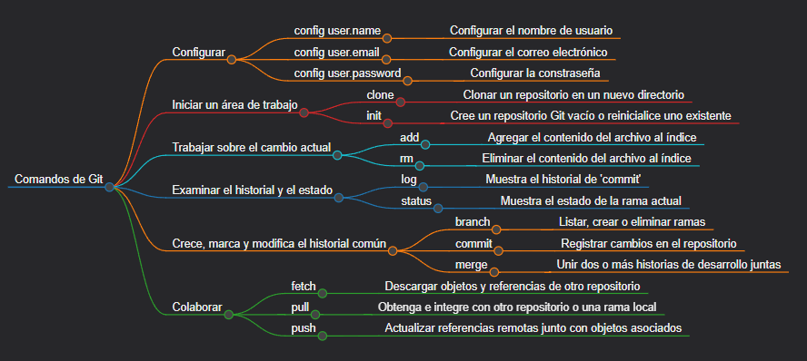

# Git y GitHub desde Cero: Aprende a Gestionar tu Código como un Pro

## Introducción

¿Quieres aprender cómo gestionar versiones de tu código de manera profesional? En este tutorial te explico desde cero cómo usar Git para controlar versiones de tus proyectos y cómo aprovechar GitHub para colaborar y almacenar tu código en la nube.



## Tabla de contenidos

- [¿Qué es Git?](#¿que-es-git?)
- [Instalación de Git](#instalacion-de-git)
- [Conceptos Básicos de Git](#conceptos-basicos-de-git)
- [Creación de un Repositorio en GitHub](#creacion-de-un-repositorio-en-github)
- [Flujo Básico de Trabajo con Git](#flujo-basico-de-trabajo-con-git)
- [Conclusión y consejos finales](#conclusion-y-consejos-finales)
- [License](#license)
- [Contact](#contact)

## ¿Qué es Git?

Git es un sistema de control de versiones distribuido que permite a múltiples personas trabajar en un proyecto de manera simultánea sin interferir en el trabajo de los demás

Es importante porque:
- Facilita la colaboración entre desarrolladores, permitiendo que cada uno trabaje en una copia local del código.
- Guarda un historial de versiones, lo que permite volver a versiones anteriores del proyecto en caso de errores.
- Permite la creación de ramas (branches) para trabajar en diferentes características o correcciones sin afectar la versión principal del proyecto.

## Instalación y configuración de Git

La instalación de Git varía dependiendo del sistema operativo que estés utilizando:

### Windows

Descarga el instalador desde la página oficial de Git. Durante la instalación, puedes configurar las opciones según tus preferencias.

### macOS
Puedes usar Homebrew para instalar Git con el siguiente comando:

```bash
brew install git
```

### Linux:

En la mayoría de distribuciones, Git ya está disponible en los repositorios oficiales. Usa el siguiente comando dependiendo de tu distribución:

```bash
sudo apt install git      # En distribuciones basadas en Debian/Ubuntu
sudo yum install git      # En distribuciones basadas en Red Hat
```

Una vez instalado, deberás configurar tu usuario, correo y contraseña


```bash
git config user.name "tu-nombre"
git config user.email "tu-correo"
git config user.password "tu-contraseña"
```

## Conceptos Básicos de Git

- Repositorio (repository): Es el lugar donde se almacena el proyecto y el historial de cambios.

- Commit: Una instantánea de los cambios en los archivos. Cada commit tiene un mensaje que describe qué cambios se hicieron.

- Branch: Una rama es una versión paralela del proyecto que permite trabajar en características nuevas sin interferir con la rama principal (usualmente llamada main o master).

- Merge: Proceso de unir cambios de una rama con otra.

- Pull: Descarga los cambios del repositorio remoto (GitHub, GitLab, etc.) a tu copia local.

- Push: Envía tus commits locales al repositorio remoto.

- Staging area: Es el área donde se preparan los archivos antes de realizar un commit.

## Creación de un Repositorio en GitHub

Para crear un repositorio en GitHub, sigue estos pasos:

- Crea / inicia sesión en tu cuenta de GitHub.

- En la esquina superior derecha, haz clic en el botón de "+" y selecciona "New repository".

- Asigna un nombre al repositorio.

- Opcionalmente, agrega una descripción, selecciona si el repositorio será público o privado.

- Puedes inicializar el repositorio con un archivo README, se utiliza como documentación de software

- Haz clic en "Create repository".

Después de crear el repositorio, puedes clonar el repositorio en tu máquina local con el comando:

```bash
git clone https://github.com/tu-usuario/nombre-del-repo.git
```

## Flujo Básico de Trabajo con Git

El flujo básico de trabajo es el siguiente:

1. Clonar el repositorio (si es la primera vez):
```bash
git clone https://github.com/tu-usuario/nombre-del-repo.git
```

2. Crear o cambiar de rama para trabajar en una nueva característica:
```bash
git checkout -b nombre-de-la-rama
```

3. Modificar los archivos del proyecto.

4. Agregar los cambios al área de stage:
```bash
git add archivo-modificado
```

5. Hacer un commit con un mensaje que describa los cambios:
```bash
git commit -m "Descripción de los cambios"
```

6. Subir los cambios al repositorio remoto:
```bash
git push origin nombre-de-la-rama
```

7. Si trabajas en equipo, hacer un pull regularmente para mantener tu versión local sincronizada:
```bash
git pull
```

## Conclusión y consejos finales

Git es una herramienta fundamental para cualquier desarrollador moderno. No sólo facilita el trabajo en equipo, sino que también permite llevar un control exhaustivo sobre el historial del proyecto. Al dominar Git, se obtiene la habilidad de gestionar proyectos complejos y colaborar efectivamente en entornos de desarrollo distribuidos.

### Consejos:

- Realiza commits frecuentemente y escribe mensajes claros y descriptivos.

- Crea ramas para cada característica o bugfix, y luego fusiónalas con la rama principal.

- Sincroniza tu repositorio local regularmente (pull y push) para evitar conflictos.

- Familiarízate con la resolución de conflictos de merge, ya que es un problema común al trabajar en equipo.

## License

This project is licensed under the MIT License. For more details, see [LICENSE](https://github.com/CompilandoYT/20240914-Git-Github/blob/main/README.md)

## Contact
